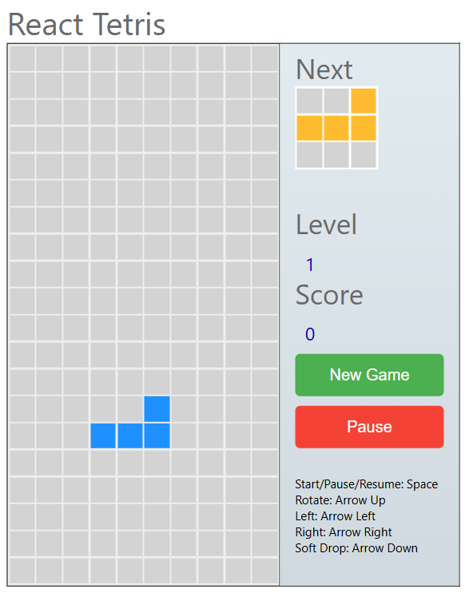

# 🎮 DevSecOps Tetris V1

A React.js-based Tetris Game integrated with a complete DevSecOps CI/CD pipeline using Jenkins, SonarQube, Docker, Terraform, Kubernetes, Amazon EKS, and ArgoCD.

<h1 align="center">
  
</h1>

---

## 🚀 Project Overview

This project demonstrates an end-to-end DevSecOps implementation for deploying a React-based Tetris application on Amazon EKS.

The project covers:

* Infrastructure provisioning using Terraform
* CI/CD automation using Jenkins
* Static code analysis using SonarQube
* Dependency vulnerability scanning
* Container security scanning using Trivy
* Docker image build and push to Docker Hub
* Kubernetes deployment on Amazon EKS
* GitOps deployment using ArgoCD

---

## 🎮 About the Application

The Tetris game is developed using:

* React.js 
* JavaScript (ES6)
* HTML5
* CSS3

### Features

* Interactive Tetris gameplay
* Score tracking
* Level progression
* Next block preview
* Pause and Resume functionality
* Keyboard controls
* Responsive user interface

---

## 🛠️ Technologies Used

### Cloud & Infrastructure

* AWS EC2
* Amazon EKS
* AWS S3
* IAM

### DevOps & DevSecOps

* GitHub
* Jenkins
* Docker
* Docker Hub
* SonarQube
* OWASP Dependency Check
* Trivy

### Container Orchestration

* Kubernetes

### GitOps

* ArgoCD

### Infrastructure as Code

* Terraform

---

## 📁 Repository Structure

```text
devsecops-Tetris-V1
├── Dockerfile
├── deployment-service.yml
├── EKS_TERRAFORM/
├── Jenkins-CICD/
├── images/
├── public/
├── src/
├── package.json
├── README.md
└── steps.sh
```

---

## ⚙️ CI/CD Workflow

```text
GitHub (Application Source Code)
            │
            ▼
        Jenkins
            │
            ├── Clean Workspace
            ├── Checkout Code
            ├── SonarQube Analysis
            ├── Quality Gate
            ├── npm Install
            ├── Docker Build
            ├── Docker Push
            ├── Trivy Scan
            │
            ▼
Docker Hub (Updated Image)
            │
            ▼
Update Kubernetes Manifest Repository
            │
            ▼
GitHub (Manifest Repository)
            │
            ▼
ArgoCD
            │
            ▼
Amazon EKS Cluster
            │
            ▼
Tetris Version 1.0 Application
```

---

## 📄 Setup & Deployment Guide

The complete project setup, installation, infrastructure provisioning, Jenkins configuration, EKS deployment, and ArgoCD setup instructions are available in:

```bash
steps.sh
```

---

## ▶️ Run Locally

Install dependencies:

```bash
npm install
```

Start the application:

```bash
npm start
```

Build for production:

```bash
npm run build
```

---

## 🐳 Docker Build

Build Docker image:

```bash
docker build -t tetris .
```

Run container:

```bash
docker run -d -p 80:80 tetris
```

Verify:

```bash
docker ps
```

---

## ☸️ Kubernetes Deployment

Deploy application:

```bash
kubectl apply -f deployment-service.yml
```

Verify resources:

```bash
kubectl get all
```

---
